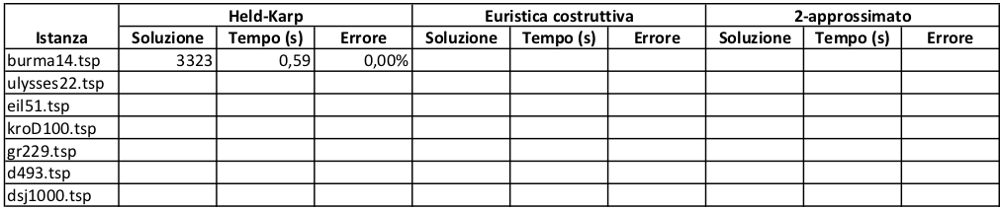

# Lab. 3 - Il Commesso Viaggiatore

### Descrizione del problema

In questo laboratorio risolveremo un problema intrattabile confrontando i tempi di calcolo e la qualità delle soluzioni che si possono ottenere con algoritmi esatti e con algoritmi di approssimazione. Il problema da affrontare è il cosiddetto "Problema del Commesso Viaggiatore" (TSP), definito come segue: date le coordinate x,y di N punti nel piano (i vertici), e una funzione di peso w(u,v) definita per tutte le coppie di punti (gli archi), trovare il ciclo semplice di peso minimo che visita tutto gli N punti. La funzione peso w(u,v) è definita come la distanza Euclidea o Geografica tra i punti u e v (potete trovare i dettagli su come calcolare la distanza nella descrizione del dataset). La funzione peso è simmetrica e rispetta la disuguaglianza triangolare.

### Algoritmi

Gli algoritmi da implementare per risolvere il problema rientrano in tre categorie: (1) algoritmi esatti; (2) euristiche costruttive; e (3) algoritmi 2-approssimati.

1. Algoritmi esatti: implementate l'algoritmo esatto di Held e Karp. Poiché questo algoritmo è di complessità esponenziale, l'implementazione deve interrompere l'esecuzione se non trova la soluzione ottima entro T minuti, restituendo la soluzione migliore trovata fino a quel momento, se esiste. Molto probabilmente l'algoritmo riuscirà a trovare la soluzione ottima solo per le istanze più piccole (circa 10 nodi), e fornirà una soluzione parziale per quelle più grandi.
2. Euristiche costruttive: scegliete una fra le euristiche costruttive viste a lezione ed implementatela: Nearest Neighbour, Closest Insertion, Farthest Insertion, Random Insertion, Cheapest Insertion.
3. Algoritmi 2-approssimati: implementate l'algoritmo 2-approssimato basato sull'albero di copertura minimo.

### Dataset
Il dataset contiene 7 grafi di esempio, sia reali che generati casualmente. Proviene da TSPLIB e si trova nel file tsp-dataset.zip allegato.

Le prime righe di ogni file contengono alcune informazioni sull'istanza, come il numero di punti N (che varia da 14 a 1000) e il tipo di coordinate: Eculidee (EUC_2D) o Geografiche (GEO). Per esempio il file eil51.tsp è fatto in questo modo:

```
NAME : eil51
COMMENT : 51-city problem (Christofides/Eilon)
TYPE : TSP
DIMENSION : 51
EDGE_WEIGHT_TYPE : EUC_2D
NODE_COORD_SECTION
1 37 52
2 49 49
3 52 64
4 20 26
...
```
Le righe poste dopo NODE_COORD_SECTION descrivono i vertici del grafo: ogni riga comprende un ID del vertice (intero univoco) seguito dalle coordinate x e y che possono essere valori reali. I tre valori sono separati da spazi.

La tabella seguente riassume alcune statistiche del dataset:


| File | Descrizione | N | Soluzione ottima |
|:-------------:|:-------------:|:-------------:|:-----:|
|burma14.tsp|Birmania (Myanmar)|14|3323|
|ulysses22.tsp|Mediterraneo|22|7013|
|eil51.tsp|Sintetico|51|426|
|kroD100.tsp|Random|100|21294|
|gr229.tsp|Asia/Australia|229|134602|
|d493.tsp|Foratura di circuiti stampati|493|35002|
|dsj1000.tsp|Random|1000|18659688|

Gestione dell'input e calcolo corretto delle distanze:
* File in formato GEO: la coordinata x è la latitudine, la coordinata y la longitudine
    * convertire le coordinate x,y in radianti usando il codice specificato nelle TSPLIB FAQ (Q: I get wrong distances for problems of type GEO.). La formula considera la parte intera di x e y (NON ARROTONDA ALL'INTERO PIU' VICINO).
    * calcolare la distanza geografica tra i punti i e j usando il codice presente nelle FAQ per "dij". Anche in questo caso il codice considera la parte intera delle distanze.

* File in formato EUC_2D: In questo caso non occorre fare conversioni di coordinate. Calcolare la distanza Eculidea e arrotondate il valore all'intero più vicino.

### Domanda 1.
Eseguite i tre algoritmi che avete implementato (Held-Karp, euristica costruttiva e 2-approssimato) sui 7 grafi del dataset. Mostrate i risultati che avete ottenuto in una tabella come quella sottostante. Le righe della tabella corrispondono alle istanze del problema. Le colonne mostrano, per ogni algoritmo, il peso della soluzione trovata, il tempo di esecuzione e l'errore relativo calcolato come (SoluzioneTrovata−SoluzioneOttima)/SoluzioneOttima. Potete aggiungere altra informazione alla tabella che ritenete interessanti. 

La tabella può essere inserita online nello spazio di testo o allegata in un file separato.

Tabella riassuntiva

### Domanda 2.

Commentate i risultati che avete ottenuto: come si comportano gli algoritmi rispetti alle varie istanze? C'è un algoritmo che riesce sempre a fare meglio degli altri rispetto all'errore di approssimazione? Quale dei tre algoritmi che avete implementato è più efficiente? 

### Domanda 3.

Allegate il codice sorgente in un unico file di archivio (.zip, .tar.gz, ecc..)