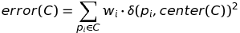
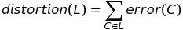

# Lab. 4 - Clustering di dati medici
In questo laboratorio analizzeremo le prestazioni dei due metodi di clustering visti a lezione su vari set di dati che rappresentano rischio di cancro negli Stati Uniti. In particolare, confronteremo i due metodi di clustering rispetto a tre parametri:

* **Efficienz**a: quale metodo impiega meno tempo per calcolare il clustering?
* **Automazione**: quale metodo richiede meno supervisione umana per generare raggruppamenti ragionevoli? 
* **Qualità**: quale metodo genera cluster con meno errori?

### Dataset
I metodi di clustering verranno applicati a diversi gruppi di dati 2D che includono informazioni sul rischio di contrarre il cancro causato da inquinanti atmosferici. La versione originale di questi dati è disponibile [in questo sito Web](https://www.epa.gov/national-air-toxics-assessment/2014-nata-assessment-results). Ogni voce nel set di dati corrisponde a una contea degli Uniti e include informazioni sulla popolazione totale della contea e il rischio di cancro pro capite.

Per facilitare la visualizzazione, i dati includono la posizione (x,y) di ogni contea [in questa mappa degli Stati Uniti](https://elearning.unipd.it/math/pluginfile.php/48589/mod_assign/intro/USA_Counties.png). Le coordinate sono specificate come pixel dell'immagine, con l'origine nell'angolo in alto a sinistra. [Questa immagine](https://elearning.unipd.it/math/pluginfile.php/48589/mod_assign/intro/full_bubbleplot.png) mostra un esempio di sovrapposizione dei dati alla mappa con un grafico a bolle il cui raggio e colore rappresentano la popolazione totale e il rischio di cancro della contea corrispondente.

Il dataset completo include 3108 contee. Usando le soglie 3.0⋅10^(−5), 3.5⋅10^(−5) e 4.0⋅10^(−5) per eliminare le contee con basso rischio di cancro si ottengono dataset più piccoli con 1041, 562 e 212 contee, rispettivamente. Questi quattro dataset saranno i nostri dati di test per i metodi di clustering e sono allegati alla pagina in formato CSV. Ogni riga dei file corrisponde ad una contea ed è composta da cinque campi in quest'ordine: codice della contea, coordinata x, coordinata y, popolazione e rischio di cancro.

### Efficienza
Le prime tre domande considerano l'efficienza degli algoritmi di Clustering Gerarchico e Clustering k-means.

### Domanda 1
Create un'immagine dei 15 cluster generati applicando l'algoritmo di Clustering Gerarchico al set di dati completo con 3108 contee. 

Utilizzate un colore diverso per identificare ogni cluster. È possibile allegare un'immagine con le 3108 contee colorate per cluster o una visualizzazione ottimizzata con le contee colorate per cluster e collegate al centro dei relativi cluster con delle linee. Non è necessario includere assi, etichette degli assi o un titolo per questa immagine. 

### Domanda 2
Create un'immagine dei 15 cluster generati applicando 5 iterazioni dell'algoritmo k-means al set di dati completo con 3108 contee. I cluster iniziali devono corrispondere alle 15 contee con la popolazione maggiore.

Utilizzate un colore diverso per identificare ogni cluster. È possibile allegare un'immagine con le 3108 contee colorate per cluster o una visualizzazione ottimizzata con le contee colorate per cluster e collegate al centro dei relativi cluster con delle linee. Non è necessario includere assi, etichette degli assi o un titolo per questa immagine.

### Domanda 3
Quale metodo di clustering è più veloce quando il numero di cluster di output è un numero piccolo o una piccola frazione del numero di punti del dataset? Fornite una breve spiegazione in termini dei tempi di esecuzione asintotici di entrambi i metodi. Assumete che HierarchicalClustering usi FastClosestPair e che k-means usi sempre un piccolo numero di iterazioni.

### Automazione
Nelle prossime domande, confronteremo il livello di supervisione umana richiesto da ciascun metodo.

### Domanda 4
Create un'immagine dei 9 cluster generati applicando l'algoritmo di Clustering Gerarchico al set di dati con 212 contee. 

Utilizzate un colore diverso per identificare ogni cluster. È possibile allegare un'immagine con le 212 contee colorate per cluster o una visualizzazione ottimizzata con le contee colorate per cluster e collegate al centro dei relativi cluster con delle linee. Non è necessario includere assi, etichette degli assi o un titolo per questa immagine.

### Domanda 5
Create un'immagine dei 9 cluster generati applicando 5 iterazioni dell'algoritmo k-means al set di dati con 212 contee. I cluster iniziali devono corrispondere alle 9 contee con la popolazione maggiore. 

Utilizzate un colore diverso per identificare ogni cluster. È possibile allegare un'immagine con le 212 contee colorate per cluster o una visualizzazione ottimizzata con le contee colorate per cluster e collegate al centro dei relativi cluster con delle linee. Non è necessario includere assi, etichette degli assi o un titolo per questa immagine.

### Domanda 6
I clustering calcolati nelle domande 4 e 5 mostrano che non tutti i risultati sono uguali. In particolare, alcuni clustering sono migliori di altri. Un modo per rendere questo concetto più preciso è formulare una misura matematica dell'errore associato a un cluster. Dato un cluster C, il suo errore è la somma dei quadrati delle distanze di ciascuna contea nel cluster dal centro del cluster, pesata per la popolazione di ciascuna contea. Se pi è la posizione della contea e wi è la sua popolazione, l'errore del cluster è:

Data una lista di cluster L, la distorsione del clustering è la somma degli errori associati ai cluster:

Calcolate la distorsione dei clustering che avete ottenuto per le domande 4 e 5. Specificate i valori di distorsione (con almeno quattro cifre significative) dei due clustering nella casella di testo sottostante, indicando a quale dei due algoritmi si riferisce ogni valore. 

Come verifica della correttezza del codice, le distorsioni associate ai 16 cluster di output prodotti da Clustering Gerarchico e k-means clustering (con 5 iterazioni) sul set di dati con 562 contee sono approssimativamente 2.26×10^11 e 3.86×10^11, rispettivamente.

### Domanda 7
Esaminate i clustering generati nelle domande 4 e 5. In particolare, concentrate la vostra attenzione sul numero e sulla forma dei cluster situati nella costa occidentale degli Stati Uniti.

Descrivete la differenza tra le forme dei cluster prodotti da questi due metodi sulla costa occidentale degli Stati Uniti. Per quale motivo un metodo produce un clustering con una distorsione molto più alta dell'altro? Per aiutarvi a rispondere a questa domanda, dovreste considerare in che modo k-means clustering genera il clustering iniziale in questo caso. Nello spiegare la vostra risposta, rivedete la geografia della costa occidentale degli Stati Uniti.

### Domanda 8
In base alla risposta alla domanda 7, quale metodo (clustering gerarchico o k-means clustering) richiede meno supervisione umana per produrre clustering con distorsione relativamente bassa?

Qualità
Nelle prossime due domande, analizzerete la qualità dei clustering prodotti da ciascun metodo come misurata dalla loro distorsione.

### Domanda 9
Calcolare la distorsione dei clustering prodotti da Clustering Gerarchico e k-means clustering (utilizzando 5 iterazioni) sui set di dati con 212, 562 e 1041 contee, rispettivamente, variando il numero di cluster di output da 6 a 20 (estremi inclusi) 

**Nota importante:** per calcolare la distorsione dei clustering prodotti da HierarchicalClustering, è bene ricordare che è possibile utilizzare il cluster gerarchico di dimensione 20 per calcolare il clustering gerarchico di dimensione 19 e così via. Altrimenti, introdurrete un fattore 15 non necessario nel tempo di calcolo dei 15 raggruppamenti gerarchici.

Dopo aver calcolato queste distorsioni per entrambi i metodi di clustering, create tre grafici separati (uno per ciascun set di dati) che confrontino la distorsione dei clustering prodotti da entrambi i metodi. Ogni figura dovrebbe includere due curve disegnate come grafici a linee. L'asse orizzontale per ciascun grafico indica il numero di cluster di output mentre l'asse verticale indica la distorsione associata a ciascun clustering. Per ogni figura, includere un titolo che indica il set di dati utilizzato nella creazione dei grafici e una legenda che distingue le due curve.

### Domanda 10
Per ciascun set di dati (212, 562 e 1041 contee), c'è un metodo di clustering che produce sempre risultati con distorsione inferiore quando il numero di cluster di output è compreso tra 6 e 20? Se è così, indicare per quali insiemi di dati un metodo è superiore all'altro.

### Domanda 11
Allegate il codice completo della vostra soluzione come un unico file di archivio (.zip, .tar.gz, ecc.)